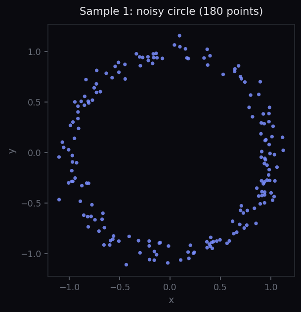
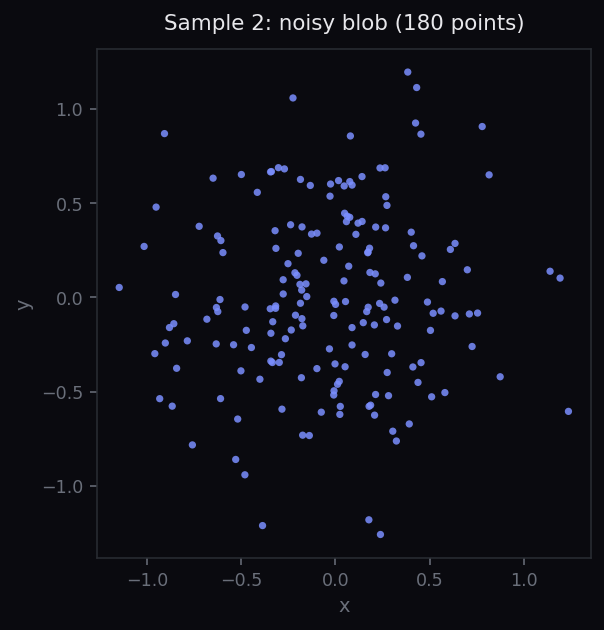
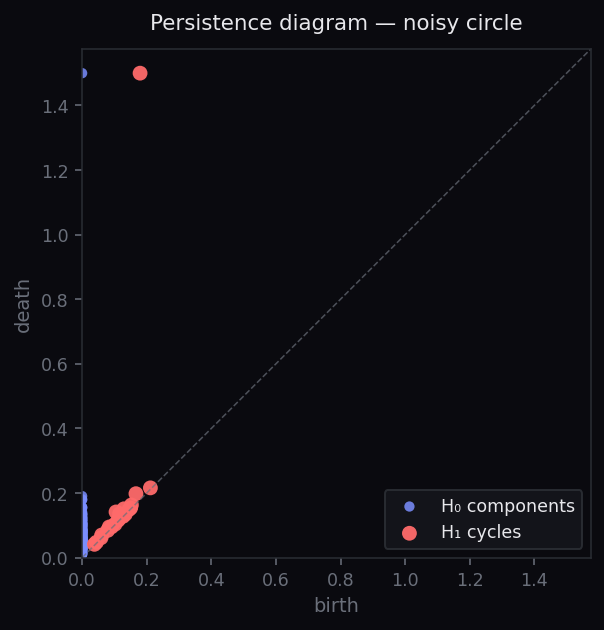
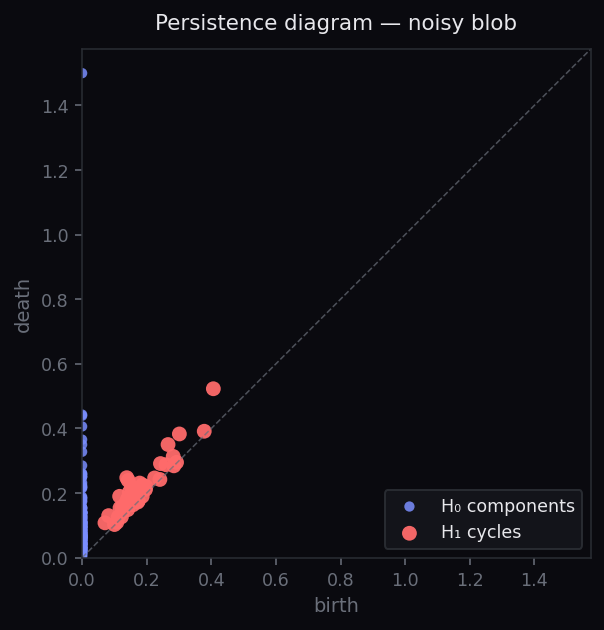

```{=html}
<nav class="akriti-nav" aria-label="Primary">
  <div class="nav-inner">
    <a href="/" class="nav-brand" aria-label="Akriti — home">
      
      <span class="nav-wordmark">ĀKRITI</span>
    </a>
    <ul class="nav-links">
      <li><a href="/#about">About</a></li>
      <li><a href="/#capabilities">Capabilities</a></li>
      <li><a href="/#compare">Compare</a></li>
      <li><a href="/#code">Code</a></li>
      <li><a href="/#team">Team</a></li>
      <li><a href="/#research">Research</a></li>
      <li><a href="/teach/" class="active">Teach</a></li>
    </ul>
    <a href="https://huggingface.co/spaces/akritihq/try" class="nav-try" target="_blank" rel="noopener">
      Try&nbsp;<span aria-hidden="true">↗</span>
    </a>
    <a href="https://github.com/akritihq" class="nav-github" aria-label="Akriti on GitHub" target="_blank" rel="noopener">
      <svg viewBox="0 0 24 24" width="20" height="20" fill="currentColor" aria-hidden="true">
        <path d="M12 .5C5.65.5.5 5.65.5 12c0 5.08 3.29 9.39 7.86 10.92.58.11.79-.25.79-.56 0-.28-.01-1.01-.02-1.99-3.2.69-3.87-1.54-3.87-1.54-.52-1.33-1.27-1.69-1.27-1.69-1.04-.71.08-.7.08-.7 1.15.08 1.76 1.18 1.76 1.18 1.02 1.75 2.69 1.25 3.34.96.1-.74.4-1.25.73-1.54-2.55-.29-5.24-1.28-5.24-5.69 0-1.26.45-2.29 1.18-3.1-.12-.29-.51-1.46.11-3.05 0 0 .96-.31 3.15 1.18.91-.25 1.89-.38 2.86-.39.97.01 1.95.14 2.86.39 2.18-1.49 3.14-1.18 3.14-1.18.62 1.59.23 2.76.11 3.05.74.81 1.18 1.84 1.18 3.1 0 4.42-2.69 5.39-5.26 5.68.41.36.78 1.06.78 2.14 0 1.55-.01 2.8-.01 3.18 0 .31.21.68.8.56C20.21 21.39 23.5 17.08 23.5 12 23.5 5.65 18.35.5 12 .5z"/>
      </svg>
    </a>
  </div>
</nav>
```

```{=html}
<section class="teach-hero">
  <div class="akriti-container">
    <h3 class="section-heading">Akriti for the classroom</h3>
    <h1 class="teach-title">Teach topological data analysis without the setup tax.</h1>
    <p class="teach-lede">A free, open teaching pack for instructors of TDA — undergraduate or graduate, mathematics or applied. Pre-built notebooks open in the browser. No installation. No environment debugging. No teaching-assistant office hours spent on <code>pip</code> errors.</p>
    <div class="teach-pack-points">
      <div class="pack-point"><strong>Zero-install for students.</strong> Click a Colab link, the lesson opens in the browser.</div>
      <div class="pack-point"><strong>Curated arc.</strong> Persistence → distance → vectorisation → classification → two-sample testing.</div>
      <div class="pack-point"><strong>Same API as research.</strong> Lessons use the Akriti library — what students will see in industry and research.</div>
      <div class="pack-point"><strong>Apache-2.0.</strong> Adapt freely; redistribute; cite if you publish on it.</div>
    </div>
  </div>
</section>
```

```{=html}
<section class="akriti-section" id="lesson">
  <div class="akriti-container">
    <h3 class="section-heading">Pilot lesson</h3>
    <h2 class="section-title">Lesson 1 — Detecting cycles in noisy data.</h2>
    <p class="lede">A 45-minute lesson for an undergraduate or beginning-graduate audience. Students learn to read a persistence diagram by computing one for two visually similar datasets that differ topologically: a noisy circle and a noisy Gaussian blob.</p>

    <div class="lesson-meta">
      <div><span class="meta-k">Time</span><span class="meta-v">45 min</span></div>
      <div><span class="meta-k">Level</span><span class="meta-v">Undergrad / early grad</span></div>
      <div><span class="meta-k">Prereqs</span><span class="meta-v">Basic Python · point-set topology</span></div>
      <div><span class="meta-k">Format</span><span class="meta-v">Colab notebook · slide deck · 4 exercises</span></div>
    </div>

    <h4 class="lesson-h">Learning objectives</h4>
    <p>By the end of this lesson, students should be able to:</p>
    <ol class="lesson-list">
      <li>Compute a persistence diagram from a 2-D point cloud.</li>
      <li>Identify H₀ (component) and H₁ (cycle) features in the diagram.</li>
      <li>Distinguish topological signal from noise by reading feature persistence.</li>
      <li>Explain why two visually different point clouds can produce the same diagram.</li>
    </ol>

    <h4 class="lesson-h">Setup</h4>
    <p>Students open the Colab notebook. The first cell imports a thin teaching wrapper around the Akriti API:</p>
    <pre class="code-block"><span class="c"># Today: a small teaching shim over GUDHI; from August 2026: real Akriti.</span>
<span class="k">from</span> <span class="n">akriti_teach</span> <span class="k">import</span> <span class="n">sample_circle</span><span class="o">,</span> <span class="n">sample_blob</span>
<span class="k">from</span> <span class="n">akriti_teach</span> <span class="k">import</span> <span class="n">persistence</span><span class="o">,</span> <span class="n">plot_pointcloud</span><span class="o">,</span> <span class="n">plot_diagram</span></pre>

    <h4 class="lesson-h">Step 1 — Two datasets that look similar</h4>
    <p>Generate two point clouds, each with 180 noisy points scattered in the unit square:</p>
    <pre class="code-block"><span class="n">circle</span> <span class="o">=</span> <span class="n">sample_circle</span><span class="o">(</span><span class="n">n</span><span class="o">=</span><span class="b">180</span><span class="o">,</span> <span class="n">noise</span><span class="o">=</span><span class="b">0.06</span><span class="o">)</span>
<span class="n">blob</span>   <span class="o">=</span> <span class="n">sample_blob</span><span class="o">(</span><span class="n">n</span><span class="o">=</span><span class="b">180</span><span class="o">,</span> <span class="n">scale</span><span class="o">=</span><span class="b">0.5</span><span class="o">)</span>

<span class="n">plot_pointcloud</span><span class="o">(</span><span class="n">circle</span><span class="o">)</span>
<span class="n">plot_pointcloud</span><span class="o">(</span><span class="n">blob</span><span class="o">)</span></pre>

    <div class="lesson-fig-row">
      <figure>
        
        <figcaption>The first dataset — points scattered around a unit circle with Gaussian noise.</figcaption>
      </figure>
      <figure>
        
        <figcaption>The second dataset — points scattered as a 2-D Gaussian blob.</figcaption>
      </figure>
    </div>

    <p class="lesson-prompt"><strong>Discussion prompt for students:</strong> visually, both datasets have a similar number of points and similar overall extent. What feature distinguishes them? Can a point-by-point summary statistic capture that feature?</p>

    <h4 class="lesson-h">Step 2 — Compute persistence</h4>
    <p>Run the same one-line call on each dataset:</p>
    <pre class="code-block"><span class="n">circle_diagram</span> <span class="o">=</span> <span class="n">persistence</span><span class="o">(</span><span class="n">circle</span><span class="o">)</span>
<span class="n">blob_diagram</span>   <span class="o">=</span> <span class="n">persistence</span><span class="o">(</span><span class="n">blob</span><span class="o">)</span>

<span class="n">plot_diagram</span><span class="o">(</span><span class="n">circle_diagram</span><span class="o">)</span>
<span class="n">plot_diagram</span><span class="o">(</span><span class="n">blob_diagram</span><span class="o">)</span></pre>

    <div class="lesson-fig-row">
      <figure>
        
        <figcaption>Persistence diagram of the noisy circle: <strong>one H₁ feature</strong> sits far from the diagonal — that's the loop.</figcaption>
      </figure>
      <figure>
        
        <figcaption>Persistence diagram of the noisy blob: every feature sits close to the diagonal — none of them are persistent.</figcaption>
      </figure>
    </div>

    <h4 class="lesson-h">Step 3 — Read the diagrams</h4>
    <p>The horizontal axis is the <em>birth</em> of a feature — the radius at which it first appears as the filtration grows. The vertical axis is its <em>death</em>. The vertical distance from the diagonal is the feature's <em>persistence</em>: how long it lives.</p>
    <p>In the circle's diagram, one red H₁ point sits far above the diagonal — that's the cycle around the circle, and it persists across a wide range of scales. In the blob's diagram, every feature dies almost immediately after birth — they are noise.</p>
    <p><strong>The key insight:</strong> visually similar point clouds can have radically different topology, and persistence is the tool that distinguishes signal from noise.</p>

    <h4 class="lesson-h">Step 4 — Exercises (15 min)</h4>
    <ol class="lesson-list">
      <li>Generate <code>two_circles = sample_two_circles(n=240, separation=3.0)</code>. Plot it. Predict its persistence diagram. Compute it. Were you right?</li>
      <li>Reduce the circle's noise to <code>noise=0.01</code>. How does the H₁ feature's persistence change? What about <code>noise=0.20</code>?</li>
      <li>Reduce the circle's sample count to <code>n=30</code>. Does the H₁ feature still appear? At what sample count does it disappear?</li>
      <li>Take a Swiss-roll dataset (<code>sample_swiss_roll()</code>). Predict and verify its diagram.</li>
    </ol>

    <h4 class="lesson-h">Discussion questions for the next class</h4>
    <ol class="lesson-list">
      <li>What assumption does our analysis make about the <em>density</em> of the sampling? When does it break?</li>
      <li>If two datasets have identical persistence diagrams, must they be topologically equivalent? (Hint: think about a circle versus a figure-eight.)</li>
      <li>How would you decide what counts as a "significant" feature? Akriti picks a threshold automatically — but what if you had to choose?</li>
    </ol>

    <div class="lesson-cta">
      <div class="cta-pack">
        <strong>This lesson includes:</strong>
        <ul>
          <li>Colab notebook (Python, executable)</li>
          <li>Beamer slide deck (LaTeX source + PDF)</li>
          <li>Solutions to all four exercises</li>
          <li>One-page instructor's guide</li>
          <li>Three reference datasets</li>
        </ul>
      </div>
      <div class="cta-actions">
        <a class="cta-btn primary" href="mailto:hello@akriti.io?subject=Akriti%20teaching%20pack%20—%20pilot%20lesson%20request">Request the pilot pack</a>
        <p class="cta-note">Available now on request. The full six-lesson pack ships with Akriti v0.0.1 in August 2026.</p>
      </div>
    </div>
  </div>
</section>
```

```{=html}
<section class="akriti-section" id="more">
  <div class="akriti-container">
    <h3 class="section-heading">More lessons coming</h3>
    <h2 class="section-title">A six-lesson arc, shipping with v0.0.1.</h2>
    <div class="upcoming-grid">
      <div class="upcoming"><div class="up-num">01</div><div class="up-title">Detecting cycles in noisy data</div><div class="up-status">Available now ↑</div></div>
      <div class="upcoming"><div class="up-num">02</div><div class="up-title">Bottleneck distance between diagrams</div><div class="up-status">In draft</div></div>
      <div class="upcoming"><div class="up-num">03</div><div class="up-title">Vectorising diagrams for ML</div><div class="up-status">In draft</div></div>
      <div class="upcoming"><div class="up-num">04</div><div class="up-title">Topological classification with certificates</div><div class="up-status">Planned</div></div>
      <div class="upcoming"><div class="up-num">05</div><div class="up-title">Two-sample testing — are these samples different?</div><div class="up-status">Planned</div></div>
      <div class="upcoming"><div class="up-num">06</div><div class="up-title">Capstone — TDA on a real biological dataset</div><div class="up-status">Planned</div></div>
    </div>
    <p class="lesson-prompt" style="margin-top:32px;">Are you teaching a TDA course (or thinking about it)? <a href="mailto:hello@akriti.io?subject=Akriti%20—%20I%20teach%20TDA">Get in touch</a> — we'll prioritise the lessons your syllabus needs and notify you when each lands.</p>
  </div>
</section>
```

```{=html}
<footer class="akriti-footer">
  <div class="akriti-container">
    <div class="seal">
      <span class="latin">AKRITI</span>
      <span class="dot"></span>
      <span class="deva">आकृति</span>
    </div>
    <div class="footer-meta">
      <span class="row">© 2026 Akriti contributors</span>
      <span class="row">Apache-2.0 · built on <a href="https://gudhi.inria.fr/">GUDHI</a> · <a href="https://github.com/akritihq">github.com/akritihq</a> · <a href="mailto:hello@akriti.io">hello@akriti.io</a></span>
    </div>
  </div>
</footer>
```
